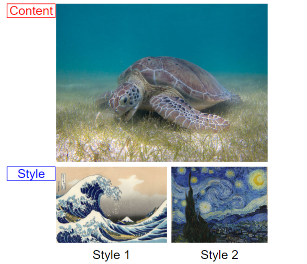

# Image-Synthesis-with-CNN-MRF

#### Group 5-a: Binh Minh NGUYEN - Minh Triet VO
This is the repository for the course Computational Imaging project with the subject: Combination of Convolutional Neural Network and Markov Random Field for image synthesis.

In this project, we replace the feature extractor VGG19 by other pretrained networks such as resnet34. The goal is to examize the influence of elements within this methodology. 

The implementation is based on: https://github.com/jonzhaocn/cnnmrf-pytorch. We added our modification to adopt resnet34 and plot the loss function. 

### Content and style images

