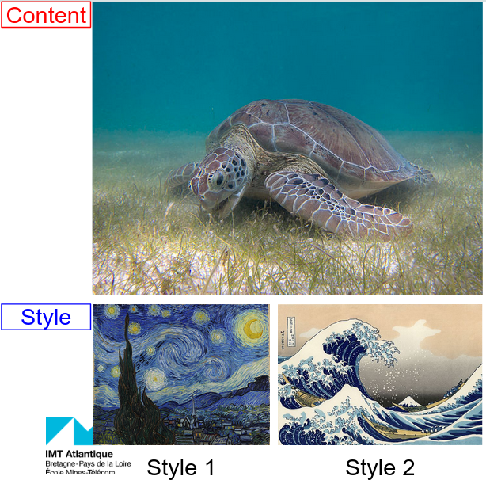
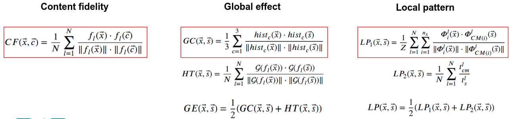
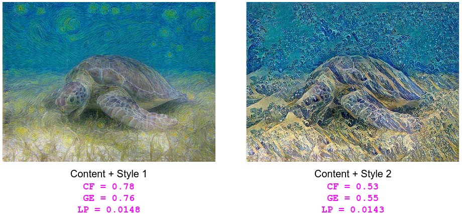
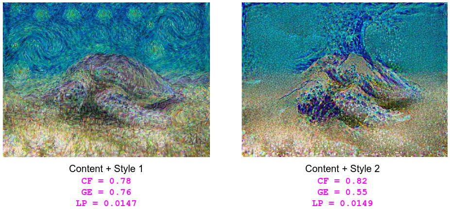

# Image Synthesis with Markov Random Field and Convolutional Neural Network

#### Group 5-a: Binh Minh NGUYEN ([minhIMT97](https://github.com/minhIMT97)) - Minh Triet VO ([trietvo3105](https://github.com/trietvo3105))
This is the repository for the course Computational Imaging project with the subject: Combination of Convolutional Neural Network and Markov Random Field for image synthesis. *The slide of our presentation is positioned in "Slide for final presentation" folder*.

In this project, we replace the feature extractor VGG19 by other pretrained networks such as resnet34. The goal is to examize the influence of the feature extractor CNN on the result. 

The implementation is based on: https://github.com/jonzhaocn/cnnmrf-pytorch. We added our modification to adopt ResNet34, compute the quantitative metrics, and plot the loss function. 

### Content and style images



### Algorithm testing

To run the code, clone this repository and run the command below in the terminal:

```
python main.py --content_path data/content1.jpg --style_path data/style1.jpg --max_iter 60 --num_res 3 --content_weight 0.4 --style_weight 0.5 --tv_weight 0.001 --mrf_style_stride 1 --mrf_synthesis_stride 1 --model resnet
```

#### Quantitative measurements
We adopted the metrics for quantitative evaluation (beside the qualitatively perceptual metrics) for this task of texture synthesis from this nice article: 

*Wang, Zhizhong & Zhao, Lei & Chen, Haibo & Zuo, Zhiwen & Li, Ailin & Xing, Wei & Lu, Dongming*. (2021). **Evaluate and improve the quality of neural style transfer**. Computer Vision and Image Understanding. 207. 103203. 10.1016/j.cviu.2021.103203



### Defaut results on VGG19



### Results on Resnet34



### Citations
```
@article{article,
         author = {Li, Chuan and Wand, Michael},
         year = {2016},
         month = {01},
         pages = {},
         title = {Combining Markov Random Fields and Convolutional Neural Networks for Image Synthesis}
        }
@article{article,
         author = {Wang, Zhizhong and Zhao, Lei and Chen, Haibo and Zuo, Zhiwen and Li, Ailin and Xing, Wei and Lu, Dongming},
         year = {2021},
         month = {03},
         pages = {103203},
         title = {Evaluate and improve the quality of neural style transfer},
         volume = {207},
         journal = {Computer Vision and Image Understanding},
         doi = {10.1016/j.cviu.2021.103203}
        }

```
