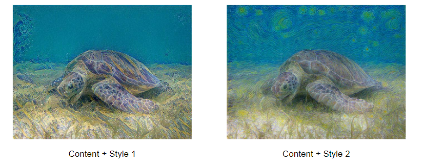
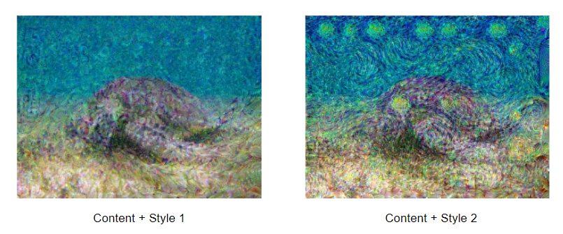

# Image-Synthesis-with-CNN-MRF

#### Group 5-a: Binh Minh NGUYEN ([minhIMT97](https://github.com/minhIMT97)) - Minh Triet VO ([trietvo3105](https://github.com/trietvo3105))
This is the repository for the course Computational Imaging project with the subject: Combination of Convolutional Neural Network and Markov Random Field for image synthesis.

In this project, we replace the feature extractor VGG19 by other pretrained networks such as resnet34. The goal is to examize the influence of the feature extractor CNN on the result. 

The implementation is based on: https://github.com/jonzhaocn/cnnmrf-pytorch. We added our modification to adopt resnet34 and plot the loss function. 

### Content and style images

### Algorithm testing

To run the code, clone this repository and run the command below in the terminal:

!python3 main.py --content_path data/content1.jpg --style_path data/style2.jpg --max_iter 60 --model resnet --num_res 3

### Defaut results on VGG19

### Results on Resnet34

